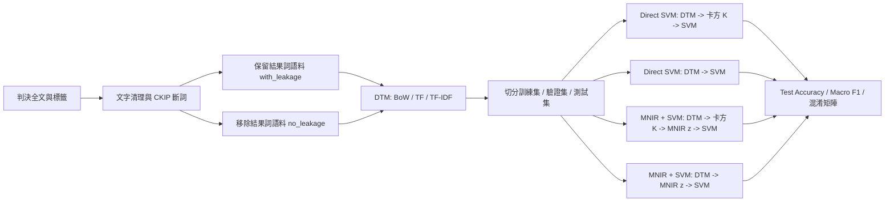

# 研究流程路徑與結果整理

本文件整理目前文字分類研究從文字特徵到測試結果的完整流程，並分別說明訓練集、驗證集與測試集在各模型路徑中的處理方式。所有數值皆來自既有 full run artifacts，沒有重新訓練模型。

## 1. 整體研究流程



## 2. 訓練集、驗證集、測試集各自經過哪些步驟

重點不是只有 70 / 10 / 20 的比例，而是所有會學到參數的步驟都只在訓練集上 fit。驗證集與測試集只能使用訓練集已經 fit 好的 selector、MNIR model 或 SVM model。

| 步驟 | 訓練集 | 驗證集 | 測試集 |
|---|---|---|---|
| DTM 列切分 | 從完整 sparse DTM 中取出訓練列，形成 `x_train` | 使用相同 DTM 欄位，只取驗證列 | 使用相同 DTM 欄位，只取測試列 |
| 卡方特徵選擇（若該路徑有卡方） | 用 `x_train` 與 `y_train` fit `SelectKBest(chi2, k)` | 用訓練集 fit 好的 selector 保留相同欄位 | 用訓練集 fit 好的 selector 保留相同欄位 |
| MNIR 投影（若該路徑有 MNIR） | 用訓練矩陣與 `y_train` fit MNIR model | 用已 fit 的 MNIR model 將驗證矩陣投影成 z 特徵 | 用已 fit 的 MNIR model 將測試矩陣投影成 z 特徵 |
| SVM 調參 | 對每個候選 C，以訓練特徵訓練 SVM | 用 Validation Macro F1 選 best C；有卡方時也用驗證集選 K | 不參與調參 |
| 最終評估 | 不作為最終報告分數 | 只用於模型與參數選擇 | 輸出最終 Accuracy、Macro F1、classification report、confusion matrix |

## 3. 詳細模型路徑

### 3.1 Direct SVM：DTM -> 卡方 -> SVM

訓練集：

```text
x_train: DTM_train
  -> 用 (x_train, y_train) fit 卡方 selector
  -> x_train_chi2 = selector.fit_transform(x_train, y_train)
  -> 用 x_train_chi2 訓練各個候選 C 的 SVM
```

驗證集：

```text
x_val: DTM_validation
  -> x_val_chi2 = fitted_selector.transform(x_val)
  -> 用各個候選 SVM 預測
  -> 依 Validation Macro F1 選 best chi-square K 與 best SVM C
```

測試集：

```text
x_test: DTM_test
  -> x_test_chi2 = fitted_selector.transform(x_test)
  -> 用選定的 SVM 預測
  -> 計算 Test Accuracy / Test Macro F1 / report / confusion matrix
```

### 3.2 Direct SVM：DTM -> SVM

```text
訓練集：x_train DTM -> 訓練各個候選 C 的 SVM
驗證集：x_val DTM   -> 依 Validation Macro F1 選 best C
測試集：x_test DTM  -> 用選定的 SVM 預測並計算測試指標
```

### 3.3 MNIR + SVM：DTM -> 卡方 -> MNIR z -> SVM

訓練集：

```text
x_train: DTM_train
  -> 用 (x_train, y_train) fit 卡方 selector
  -> x_train_chi2
  -> 用 (x_train_chi2, y_train) fit MNIR model
  -> z_train = MNIR projection of x_train_chi2
  -> 用 z_train 訓練各個候選 C 的 SVM
```

驗證集：

```text
x_val: DTM_validation
  -> x_val_chi2 = fitted_selector.transform(x_val)
  -> z_val = fitted_MNIR_model.project(x_val_chi2)
  -> 依 Validation Macro F1 選 best chi-square K 與 best C
```

測試集：

```text
x_test: DTM_test
  -> x_test_chi2 = fitted_selector.transform(x_test)
  -> z_test = fitted_MNIR_model.project(x_test_chi2)
  -> 用選定的 SVM 預測並計算測試指標
```

### 3.4 MNIR + SVM：DTM -> MNIR z -> SVM

```text
訓練集：x_train DTM -> fit MNIR -> z_train -> 訓練 SVM
驗證集：x_val DTM   -> fitted MNIR projection -> z_val -> 選 best C
測試集：x_test DTM  -> fitted MNIR projection -> z_test -> 計算最終測試指標
```

## 4. 矩陣形狀

### 4.1 原始 DTM 形狀

DTM 是 sparse document-term matrix。列代表判決文件，欄代表詞彙特徵。BoW、TF、TF-IDF 在同一資料集與同一語料版本下形狀相同，但格子裡的值不同。

`nnz` 是 sparse matrix 裡非零值的數量。DTM 大部分格子都是 0，所以只儲存非零格。例如某篇判決有 200 個詞彙特徵的值不是 0，這些格子就會計入 `nnz`。`矩陣密度 = nnz / (列數 x 欄數)`。

| 資料集 | 語料版本 | 特徵表示 | DTM 形狀 | 非零值數量 nnz | 矩陣密度 |
|---|---|---|---:|---:|---:|
| 行政 | 移除結果詞 | BoW | 11,310 x 21,428 | 740,220 | 0.3054% |
| 行政 | 移除結果詞 | TF | 11,310 x 21,428 | 740,220 | 0.3054% |
| 行政 | 移除結果詞 | TF-IDF | 11,310 x 21,428 | 740,220 | 0.3054% |
| 行政 | 保留結果詞 | BoW | 11,310 x 22,144 | 780,599 | 0.3117% |
| 行政 | 保留結果詞 | TF | 11,310 x 22,144 | 780,599 | 0.3117% |
| 行政 | 保留結果詞 | TF-IDF | 11,310 x 22,144 | 780,599 | 0.3117% |
| 民事 | 移除結果詞 | BoW | 5,660 x 24,425 | 681,384 | 0.4929% |
| 民事 | 移除結果詞 | TF | 5,660 x 24,425 | 681,384 | 0.4929% |
| 民事 | 移除結果詞 | TF-IDF | 5,660 x 24,425 | 681,384 | 0.4929% |
| 民事 | 保留結果詞 | BoW | 5,660 x 25,173 | 730,862 | 0.5130% |
| 民事 | 保留結果詞 | TF | 5,660 x 25,173 | 730,862 | 0.5130% |
| 民事 | 保留結果詞 | TF-IDF | 5,660 x 25,173 | 730,862 | 0.5130% |
| 刑事 | 移除結果詞 | BoW | 26,131 x 38,159 | 2,203,537 | 0.2210% |
| 刑事 | 移除結果詞 | TF | 26,131 x 38,159 | 2,203,537 | 0.2210% |
| 刑事 | 移除結果詞 | TF-IDF | 26,131 x 38,159 | 2,203,537 | 0.2210% |
| 刑事 | 保留結果詞 | BoW | 26,131 x 38,896 | 2,241,689 | 0.2206% |
| 刑事 | 保留結果詞 | TF | 26,131 x 38,896 | 2,241,689 | 0.2206% |
| 刑事 | 保留結果詞 | TF-IDF | 26,131 x 38,896 | 2,241,689 | 0.2206% |
| CWC | 移除結果詞 | BoW | 1,807 x 5,773 | 148,052 | 1.4192% |
| CWC | 移除結果詞 | TF | 1,807 x 5,773 | 148,052 | 1.4192% |
| CWC | 移除結果詞 | TF-IDF | 1,807 x 5,773 | 148,052 | 1.4192% |
| CWC | 保留結果詞 | BoW | 1,807 x 5,912 | 164,155 | 1.5366% |
| CWC | 保留結果詞 | TF | 1,807 x 5,912 | 164,155 | 1.5366% |
| CWC | 保留結果詞 | TF-IDF | 1,807 x 5,912 | 164,155 | 1.5366% |

### 4.2 移除結果詞版本：切分、卡方與 MNIR 後的形狀

`MNIR z 訓練集` 是 DTM 經 MNIR 投影後的矩陣。在這些 run 中，它都是 `訓練筆數 x 2`，因為 `textir::srproj` 對已 fit 的 MNIR model 產生了 2 個 sufficient-reduction score columns。這 2 欄是壓縮後的 MNIR 特徵，給後面的 SVM 使用；它不是 2 個 label，也不是 2 個類別。

| 資料集 | 特徵表示 | 原始 DTM | 訓練集 | 驗證集 | 測試集 | MNIR 路徑卡方 K | MNIR 路徑卡方後 DTM | MNIR z 訓練集 | Direct SVM 路徑卡方 K | Direct SVM 卡方後 DTM | MNIR z 訓練集（DTM -> MNIR） |
|---|---|---:|---:|---:|---:|---:|---:|---:|---:|---:|---:|
| 行政 | BoW | 11,310 x 21,428 | 7,916 x 21,428 | 1,131 x 21,428 | 2,263 x 21,428 | 5,000 | 7,916 x 5,000 | 7,916 x 2 | 3,000 | 7,916 x 3,000 | 7,916 x 2 |
| 行政 | TF | 11,310 x 21,428 | 7,916 x 21,428 | 1,131 x 21,428 | 2,263 x 21,428 | 1,000 | 7,916 x 1,000 | 7,916 x 2 | 3,000 | 7,916 x 3,000 | 7,916 x 2 |
| 行政 | TF-IDF | 11,310 x 21,428 | 7,916 x 21,428 | 1,131 x 21,428 | 2,263 x 21,428 | 5,000 | 7,916 x 5,000 | 7,916 x 2 | 3,000 | 7,916 x 3,000 | 7,916 x 2 |
| 民事 | BoW | 5,660 x 24,425 | 3,961 x 24,425 | 566 x 24,425 | 1,133 x 24,425 | 10,000 | 3,961 x 10,000 | 3,961 x 2 | 10,000 | 3,961 x 10,000 | 3,961 x 2 |
| 民事 | TF | 5,660 x 24,425 | 3,961 x 24,425 | 566 x 24,425 | 1,133 x 24,425 | 1,000 | 3,961 x 1,000 | 3,961 x 2 | 3,000 | 3,961 x 3,000 | 3,961 x 2 |
| 民事 | TF-IDF | 5,660 x 24,425 | 3,961 x 24,425 | 566 x 24,425 | 1,133 x 24,425 | 1,000 | 3,961 x 1,000 | 3,961 x 2 | 5,000 | 3,961 x 5,000 | 3,961 x 2 |
| 刑事 | BoW | 26,131 x 38,159 | 18,291 x 38,159 | 2,613 x 38,159 | 5,227 x 38,159 | 10,000 | 18,291 x 10,000 | 18,291 x 2 | 1,000 | 18,291 x 1,000 | 18,291 x 2 |
| 刑事 | TF | 26,131 x 38,159 | 18,291 x 38,159 | 2,613 x 38,159 | 5,227 x 38,159 | 1,000 | 18,291 x 1,000 | 18,291 x 2 | 5,000 | 18,291 x 5,000 | 18,291 x 2 |
| 刑事 | TF-IDF | 26,131 x 38,159 | 18,291 x 38,159 | 2,613 x 38,159 | 5,227 x 38,159 | 5,000 | 18,291 x 5,000 | 18,291 x 2 | 1,000 | 18,291 x 1,000 | 18,291 x 2 |
| CWC | BoW | 1,807 x 5,773 | 1,264 x 5,773 | 181 x 5,773 | 362 x 5,773 | 3,000 | 1,264 x 3,000 | 1,264 x 2 | 3,000 | 1,264 x 3,000 | 1,264 x 2 |
| CWC | TF | 1,807 x 5,773 | 1,264 x 5,773 | 181 x 5,773 | 362 x 5,773 | 1,000 | 1,264 x 1,000 | 1,264 x 2 | 3,000 | 1,264 x 3,000 | 1,264 x 2 |
| CWC | TF-IDF | 1,807 x 5,773 | 1,264 x 5,773 | 181 x 5,773 | 362 x 5,773 | 3,000 | 1,264 x 3,000 | 1,264 x 2 | 5,000 | 1,264 x 5,000 | 1,264 x 2 |

## 5. 主要結果：移除結果詞版本 / Test Macro F1

移除結果詞版本較適合作為論文主結果，因為它先移除裁判結果提示詞，再進行特徵萃取。

`Macro F1 差值` 的計算方式如下：

```text
Macro F1 差值 = Macro F1(DTM -> 模型) - Macro F1(DTM -> 卡方 -> 模型)
```

正值代表 `DTM -> 模型` 路徑的 Macro F1 較高；負值代表 `DTM -> 卡方 -> 模型` 路徑的 Macro F1 較高。

在這張表中，若模型是 `Proposed MNIR + SVM`，則 `DTM -> 模型` 代表 `DTM -> MNIR z -> SVM`；`DTM -> 卡方 -> 模型` 代表 `DTM -> 卡方 -> MNIR z -> SVM`。

| 資料集 | 特徵表示 | 模型 | DTM -> 卡方 -> 模型 | DTM -> 模型 | Macro F1 差值 |
|---|---|---|---:|---:|---:|
| 行政 | BoW | BOW + SVM | 0.3805 | 0.4047 | 0.0242 |
| 行政 | BoW | Proposed MNIR + SVM | 0.3184 | 0.3185 | 0.0001 |
| 行政 | TF | Proposed MNIR + SVM | 0.3114 | 0.3114 | 0.0000 |
| 行政 | TF | TF + SVM | 0.3412 | 0.3427 | 0.0015 |
| 行政 | TF-IDF | Proposed MNIR + SVM | 0.3109 | 0.3112 | 0.0003 |
| 行政 | TF-IDF | TFIDF + SVM | 0.3753 | 0.3894 | 0.0141 |
| 民事 | BoW | BOW + SVM | 0.4028 | 0.4164 | 0.0136 |
| 民事 | BoW | Proposed MNIR + SVM | 0.3358 | 0.3419 | 0.0061 |
| 民事 | TF | Proposed MNIR + SVM | 0.3202 | 0.2959 | -0.0243 |
| 民事 | TF | TF + SVM | 0.4171 | 0.4391 | 0.0220 |
| 民事 | TF-IDF | Proposed MNIR + SVM | 0.3525 | 0.2966 | -0.0559 |
| 民事 | TF-IDF | TFIDF + SVM | 0.4278 | 0.4289 | 0.0011 |
| 刑事 | BoW | BOW + SVM | 0.5637 | 0.5975 | 0.0338 |
| 刑事 | BoW | Proposed MNIR + SVM | 0.3636 | 0.3733 | 0.0097 |
| 刑事 | TF | Proposed MNIR + SVM | 0.3702 | 0.3445 | -0.0257 |
| 刑事 | TF | TF + SVM | 0.5773 | 0.5248 | -0.0525 |
| 刑事 | TF-IDF | Proposed MNIR + SVM | 0.3902 | 0.3719 | -0.0183 |
| 刑事 | TF-IDF | TFIDF + SVM | 0.5622 | 0.5831 | 0.0210 |
| CWC | BoW | BOW + SVM | 0.6541 | 0.6807 | 0.0265 |
| CWC | BoW | Proposed MNIR + SVM | 0.5420 | 0.5441 | 0.0021 |
| CWC | TF | Proposed MNIR + SVM | 0.5454 | 0.5431 | -0.0022 |
| CWC | TF | TF + SVM | 0.5797 | 0.5838 | 0.0041 |
| CWC | TF-IDF | Proposed MNIR + SVM | 0.5373 | 0.5391 | 0.0018 |
| CWC | TF-IDF | TFIDF + SVM | 0.5716 | 0.5755 | 0.0039 |

### 5.1 各資料集與模型類型的最佳設定

| 資料集 | 模型 | 特徵表示 | 最佳路徑 | Test Accuracy | Test Macro F1 | Best C |
|---|---|---|---|---:|---:|---:|
| 行政 | BOW + SVM | BoW | DTM -> 模型 | 0.8299 | 0.4047 | 0.5 |
| 行政 | Proposed MNIR + SVM | BoW | DTM -> 模型 | 0.8758 | 0.3185 | 0.0625 |
| 行政 | TF + SVM | TF | DTM -> 模型 | 0.8732 | 0.3427 | 4 |
| 行政 | TFIDF + SVM | TF-IDF | DTM -> 模型 | 0.8568 | 0.3894 | 4 |
| 民事 | BOW + SVM | BoW | DTM -> 模型 | 0.6523 | 0.4164 | 0.0625 |
| 民事 | Proposed MNIR + SVM | TF-IDF | DTM -> 卡方 -> 模型 | 0.6955 | 0.3525 | 0.125 |
| 民事 | TF + SVM | TF | DTM -> 模型 | 0.6920 | 0.4391 | 2 |
| 民事 | TFIDF + SVM | TF-IDF | DTM -> 模型 | 0.6840 | 0.4289 | 2 |
| 刑事 | BOW + SVM | BoW | DTM -> 模型 | 0.9487 | 0.5975 | 0.0625 |
| 刑事 | Proposed MNIR + SVM | TF-IDF | DTM -> 卡方 -> 模型 | 0.9277 | 0.3902 | 0.125 |
| 刑事 | TF + SVM | TF | DTM -> 卡方 -> 模型 | 0.9514 | 0.5773 | 4 |
| 刑事 | TFIDF + SVM | TF-IDF | DTM -> 模型 | 0.9462 | 0.5831 | 1 |
| CWC | BOW + SVM | BoW | DTM -> 模型 | 0.8757 | 0.6807 | 0.0625 |
| CWC | Proposed MNIR + SVM | TF | DTM -> 卡方 -> 模型 | 0.8232 | 0.5454 | 0.125 |
| CWC | TF + SVM | TF | DTM -> 模型 | 0.8729 | 0.5838 | 1 |
| CWC | TFIDF + SVM | TF-IDF | DTM -> 模型 | 0.8619 | 0.5755 | 0.5 |

## 6. 結果解讀

- Direct SVM 直接使用 DTM 的效果較穩定，多數情況下比先做卡方特徵選擇更好
- MNIR + SVM 對卡方較敏感。在部分 TF / TF-IDF 設定下，先做卡方再進 MNIR 可能讓投影較穩定。
- MNIR + SVM 雖然可以把高維 DTM 壓縮成低維 z 特徵，但目前結果沒有優於 Direct SVM。這代表 MNIR 降維後可能犧牲了一些對分類有用的文字訊號
- 卡方特徵選擇不是一定有效。它在部分 MNIR 路徑或特定資料集有幫助，但對 Direct SVM 來說，直接使用完整 DTM 通常表現更好