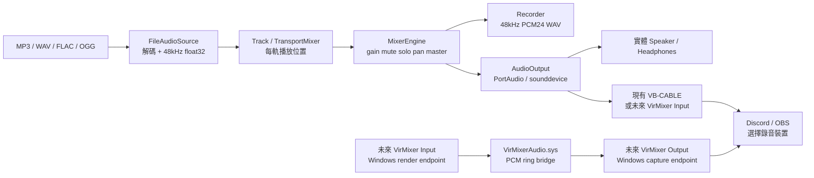
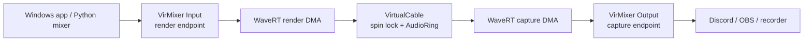

# VirMixer 專案架構說明

這份文件是給 ChatGPT、Codex 或新接手的工程師快速理解目前專案。它描述的是 `C:\Users\UUU\Documents\GitHub\Personal-Project\vir_mixer`；不包含旁邊 `voice` 專案的 RVC／變聲器程式碼。

## 專案目標

VirMixer 有兩個相互獨立、但預計可串接的部分：

1. Python 音檔混音台：目前可播放多首音檔、各軌控制、混音、錄音，並輸出到 Windows 的實體或既有虛擬音訊裝置。
2. Windows 核心虛擬音訊驅動原型：目標是提供自家的 `VirMixer Input` 播放端與 `VirMixer Output` 錄音端，讓 Discord／OBS 等程式從錄音端接收 mixer 的 PCM。

目前 Python mixer 可正常使用既有的 VB-CABLE 作為 Discord 路由。VirMixerAudio 驅動已完成 source、build、INF、catalog 套件驗證，也曾在測試環境載入並通過 shared-mode PCM 測試；exclusive-mode restart stress 仍有真實 underrun／零區段問題，正在以 Debug instrumentation 調查。



`VirMixer Input` 是讓播放程式輸出的 Windows 播放端；`VirMixer Output` 是 Discord／OBS 要選作麥克風的 Windows 錄音端。名稱遵循常見虛擬線材語意，但兩者尚未在系統出現。

## Python mixer

### 執行入口與使用方式

- `run_mixer.py`：預設啟動 PySide6 GUI；`--cli` 是單檔播放 smoke test；`--list-devices` 列出 PortAudio 裝置。
- `start.ps1`：便利啟動腳本。
- 根目錄的 `p0002-7.mp3`：預設示範輸入，不會自動播放。
- `requirements.txt`：Python 依賴；核心使用 PySide6、numpy、soundfile、librosa、sounddevice。

### 模組責任

| 檔案 | 責任 | 不負責 |
|---|---|---|
| `mixer/audio_source.py` | 用 SoundFile 解碼檔案；需要時以 librosa 重採樣；統一成連續的 48 kHz `float32` PCM。 | 不做混音與輸出。 |
| `mixer/transport.py` | `Track` 保存每軌 PCM、cursor、play/pause/stop/seek/loop；每次拉取 480 frames，結尾補零。`TransportMixer` 將每軌資料交給 mixer。 | 不讀檔、不開音效裝置。 |
| `mixer/mixer_engine.py` | 純 PCM mixer。每軌 gain/mute/solo/pan、master gain/mute、peak meter、10 ms 控制漸變、最後硬截幅。 | 不知道資料來自 MP3、麥克風或驅動。 |
| `mixer/audio_output.py` | 檢查輸出端是否支援 48 kHz，開啟 blocking PortAudio `OutputStream`；做 mono/stereo 適配；統計 output underflow。 | 不列舉裝置、不錄音。 |
| `mixer/runtime.py` | `AudioRuntime` 是唯一實際開關／寫入音訊裝置的 QThread；命令佇列避免 GUI 直接碰音訊；`FileLoader` 在另一條 QThread 解碼。 | 不直接畫 UI。 |
| `mixer/recorder.py` | 有上限 queue 的背景 WAV writer；輸出為 48 kHz、stereo、PCM_24。若磁碟太慢，保留已錄內容並停止錄音。 | 不錄每一軌的 dry signal。 |
| `mixer/devices.py` | 透過 sounddevice 建立 input/output inventory；以 name + host API 重新定位輸出裝置，避免保存不穩定 index。 | 不把麥克風加入 mixer。 |
| `mixer/device_panel.py` | GUI 裝置面板；每 5 秒用獨立程序重新列舉，避免背景刷新中斷目前播放。 | 不開啟裝置或做 PCM。 |
| `mixer/session.py` | 驗證並讀寫 JSON scene：音檔路徑、軌道設定、master 設定、輸出裝置 identity。 | 不保存播放位置、PCM、錄音狀態。 |
| `mixer/mixer_gui.py` | PySide6 多軌控制台、meter、transport、錄音、設定與裝置 UI。 | 不在 GUI thread 處理 audio block。 |

### Python 資料格式與時序

- 音訊引擎內部固定為 48,000 Hz、frame-major NumPy `float32`、shape `(frames, channels)`。
- 一個 block 是 480 frames，即 10 ms。
- `FileAudioSource` 目前採「整檔解碼到 RAM，再小 block 播放」。這避免 block 邊界重採樣問題，但長檔、多軌會佔用較多記憶體。
- `TransportMixer` 內部一律用 stereo。mono 來源會複製為雙聲道。
- `AudioOutput` 可送 mono 或 stereo 裝置：stereo→mono 使用左右平均，mono→stereo 使用複製。
- 只有音訊 owner thread 呼叫 `AudioOutput.write()`。檔案載入、錄音寫檔與裝置盤點均不阻塞它。

### 控制與混音語意

- Gain 是線性倍率；GUI 顯示／操作 dB。每軌範圍 −∞ 到 +12 dB，master 是 −∞ 到 +6 dB。
- Mute 優先於 Solo。只要任一軌 Solo，非 Solo 軌都不進主混音。
- Pan 是 stereo balance：中間保留原本 L/R；向左只衰減右邊，向右只衰減左邊。
- 控制值改變時在一個 block 內線性漸變，降低爆音。
- meter 是推桿後的每軌 peak；master meter 在硬截幅前計算。輸出最後限制於 `[-1, 1]`，不是 compressor/limiter。
- Recorder 錄的是送往主輸出的最終 PCM，包含 master、mute、solo、pan 和截幅。

### Python 已完成功能

- 最多 32 軌音檔；可重複加入相同檔案，各軌 transport 獨立。
- 各軌 play/pause/stop/seek/loop、gain、mute、solo、pan、meter。
- 全部播放／暫停／停止、master gain/mute/meter/clip indicator。
- 主輸出裝置選擇、完整 input/output 裝置清單與 hot-plug 重掃。
- 混音輸出錄成新的 WAV，不覆蓋既有檔案。
- JSON scene 儲存／載入。
- 實體喇叭或 VB-CABLE 路由。Discord 現行接法是：mixer output 選 `CABLE Input`，Discord microphone 選 `CABLE Output`，Discord speaker 留在實體耳機。

### Python 尚未做

- 麥克風輸入軌、desktop loopback、RVC、VST、EQ、compressor、AUX send、雙輸出／耳機監聽、ASIO、即時磁碟串流解碼。
- 未承諾專業音訊等級的低延遲，實際 latency 受 Windows／PortAudio device buffer 影響。

## VirMixerAudio Windows 驅動

### 目標資料路徑



驅動是 Microsoft SysVAD 衍生品，固定 upstream revision `97429c5623590d52f001249460daf43e6749d777`。它不是 VB-CABLE 的 wrapper，也沒有使用其驅動程式碼。

### 驅動檔案與生成規則

| 路徑 | 用途 |
|---|---|
| `driver/prepare.py` | 從固定 SysVAD source 生成修改後來源。永久 source patch 必須在這裡或 `driver/core/`，不可只手改生成目錄。 |
| `driver/core/AudioRing.h` | 不依賴 Windows 的固定容量 PCM ring algorithm。 |
| `driver/core/VirtualCable.h` | Kernel wrapper：每個 adapter 一個 ring，KSPIN_LOCK 保護 Read/Write/Reset。 |
| `driver/package/VirMixerAudio.inx` | INF 模板：`Root\VirMixerAudio`、`VirMixerAudio` service、兩個端點名稱與介面。 |
| `driver/build.ps1` | Debug/Release WDK build。只 build，不安裝、不簽章、不改安全設定。 |
| `driver/package.ps1` | prepare/build 後複製精確 SYS/INF 到新 package 目錄，執行 InfVerif、Inf2Cat、hash manifest 與 offline package check。 |
| `driver/target.ps1` | 已寫好但未執行的測試簽章、信任、test mode、安裝、移除、Verifier 操作；全部要管理員權限與明確 `-Apply`。 |
| `driver/tests/` | Source、package、ring algorithm、PCM runtime analyzer 的驗證。 |
| `driver/RUNTIME_TESTING.md` | 安裝後 PCM、壓力、sleep/wake、Verifier、Discord/OBS 與 rollback 程序。 |

`driver/upstream/` 與 `driver/build-source/` 可由 `prepare.py` 再生，並被 Git 忽略。生成內容有 SHA256 manifest；若手動改過生成檔，普通 `prepare.py` 會拒絕覆蓋。

### 目前驅動設計

- Windows device hardware ID：`Root\VirMixerAudio`；service：`VirMixerAudio`。
- 端點：`VirMixer Input`（render）與 `VirMixer Output`（capture）。
- 唯一硬體格式：48 kHz、PCM16、stereo；shared-mode 的其他 client format 由 Windows audio engine 轉換，exclusive mode 不支援其他格式。
- 每個 adapter 有 19,200 bytes（100 ms）的 nonpaged ring；啟動／underrun 恢復時需要 3,840 bytes（20 ms）預填。
- ring 滿時丟棄最舊完整 stereo frame；ring 不足時 capture 填零，不讀取未初始化資料。
- ring read/write/reset 都在 KSPIN_LOCK 下進行，streaming path 不配置記憶體、不做 file I/O、不取 user pointer。
- 只允許一個底層 render stream 與一個底層 capture stream；多程式 shared-mode mixer 由 Windows 本身處理。
- state transition 會清空 ring，防止新串流讀到舊 PCM，但另一側可能短暫 silence 並重新預填，因此目前不是 gapless cable。
- 已移除 SysVAD sample 的 capture sine wave、kernel WAV recording、未實作的 capture volume/mute/peak nodes、Bluetooth/USB sideband、offload 與 loopback pin。
- stream teardown 已改為先停止／等候 timer 與 DPC，再釋放 miniport／DPC 記憶體，避免 callback 使用已釋放物件。

### 驅動目前驗證狀態

| 項目 | 狀態 |
|---|---|
| Debug x64 / Release x64 build、link | 通過，0 warnings / 0 errors。 |
| ApiValidator Universal check | 通過。 |
| INF `InfVerif /u` | 通過。 |
| `Inf2Cat` signability / catalog creation | 通過，無 error/warning；產生的 catalog 尚未簽章。 |
| Offline package hash、x64 PE、INF identity check | 通過。 |
| Native AudioRing tests | 通過 200,000 次隨機／differential operations。 |
| Python PCM analyzer tests | 通過；可偵測靜音、錯聲道、反相、錯 gain、短 capture、L/R timing mismatch。 |
| Windows 驅動簽章／安裝 | 已在測試環境進行過；最新診斷 build 尚未取代已安裝版本。 |
| Windows endpoints、實際 render→capture PCM correlation | Shared mode 曾通過 10/10；exclusive restart stress 在 Continue mode 失敗 11/100。 |
| Sleep/wake、Driver Verifier、Discord/OBS 實測 | 未做。 |

「SYS 能編譯」或「endpoint 出現在 Windows」都不能算完成；真正完成至少需在已安裝裝置上以獨立左右 PCM 驗證 render→ring→capture correlation、gain、聲道同步、silence、restart、long-running 行為。

## 建置、驗證與安全邊界

以下操作只改 repository／build output，不改 Windows 系統狀態：

```powershell
Set-Location 'C:\Users\UUU\Documents\GitHub\Personal-Project\vir_mixer'
$python = 'C:\Users\UUU\anaconda3\envs\xin\python.exe'
& .\driver\package.ps1 -Configuration Debug -Python $python
& .\driver\package.ps1 -Configuration Release -Python $python
& $python driver/tests/verify_source.py
& $python driver/tests/test_prepare.py -v
& $python driver/tests/test_verify_driver.py -v
```

安裝前後流程、精確命令、可能風險和 rollback 在 `driver/RUNTIME_TESTING.md`。未經使用者明確批准，不得執行下列系統影響操作：建立／信任 test certificate、開啟 test signing、重新開機、安裝 kernel driver、建立 root devnode、修改 Driver Store、改 Secure Boot／Memory Integrity、啟用 Driver Verifier。

## 接手此專案時的工作規則

1. 先閱讀根目錄 `CODEX_CHECKPOINT.md`、本文件與 `driver/RUNTIME_TESTING.md`。
2. 不修改 sibling `voice`／RVC 專案。
3. 不使用舊的 `TabletAudioSample.sys`；只使用 `VirMixerAudio.sys` 及 `latest-package-*.txt` 指向的套件。
4. 不要重做已解決的 WDK／Sideband／MSB8020／TargetName／x86 tool 問題。
5. 生成 driver source 的永久修改請放到 `driver/prepare.py` 或 `driver/core/`，重跑 prepare + build + package 驗證。
6. 安裝驅動後必須先跑 `driver/tests/verify_driver.py --run`；不能因為 Device Manager 看得到裝置就宣告成功。
7. 任何安裝、test signing、Driver Verifier 或 boot/security 更改，都需要使用者另行明確授權。
